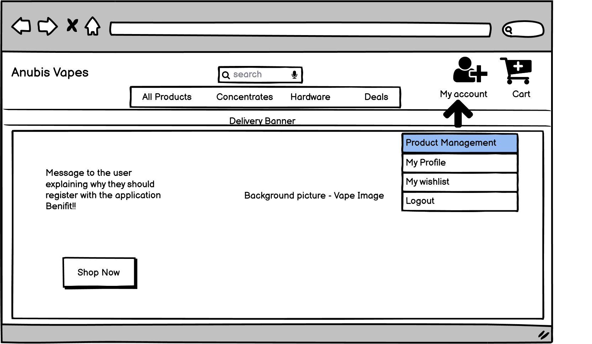
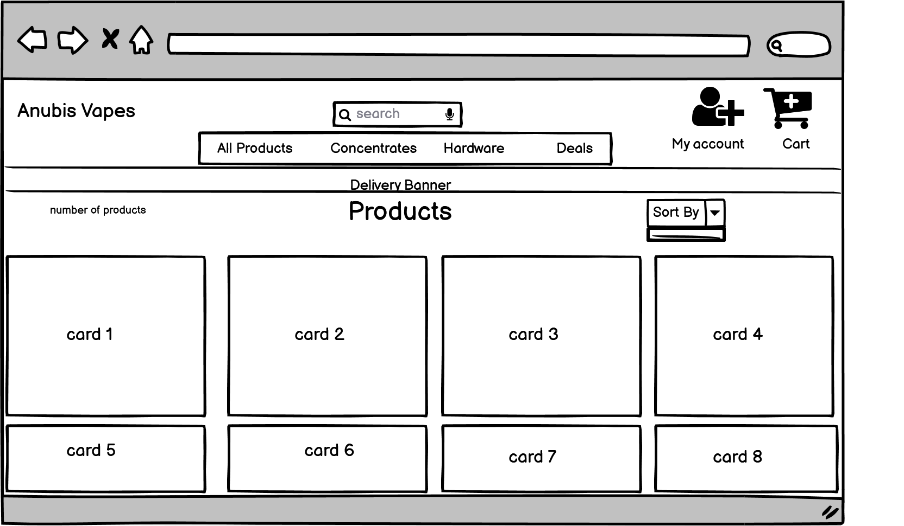
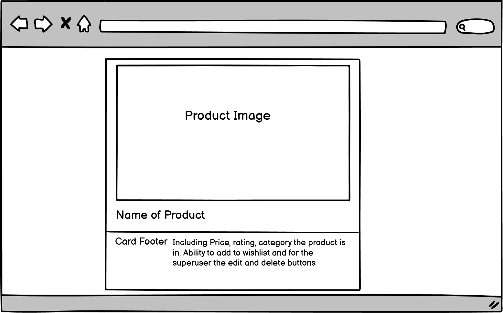
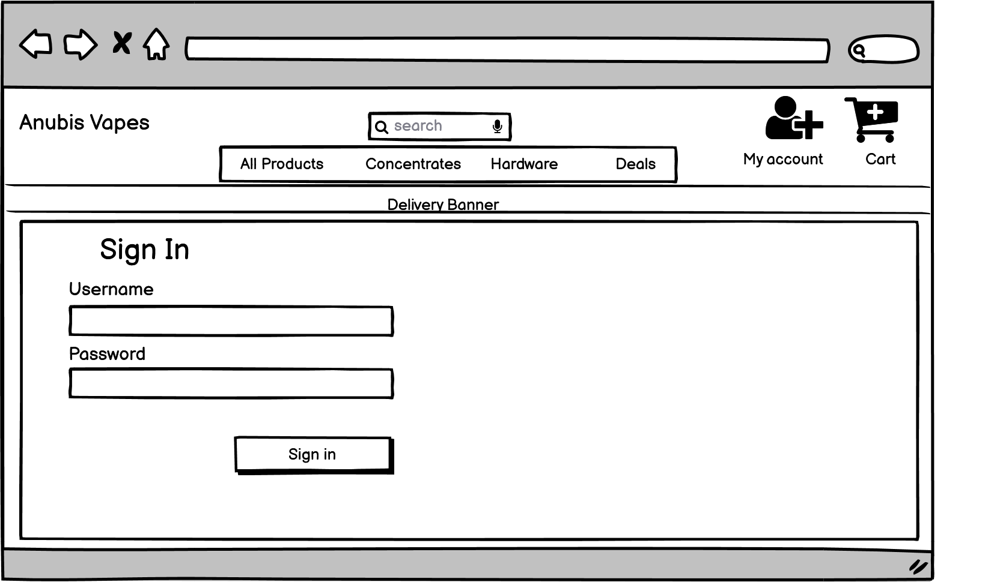
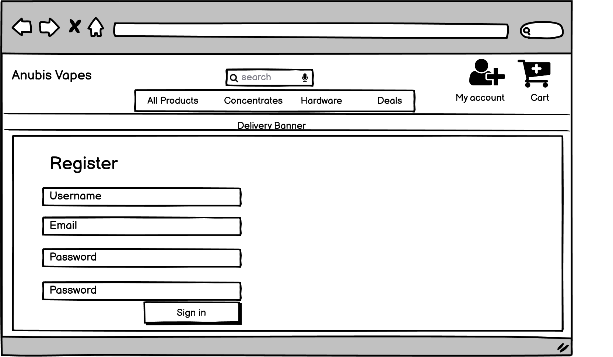
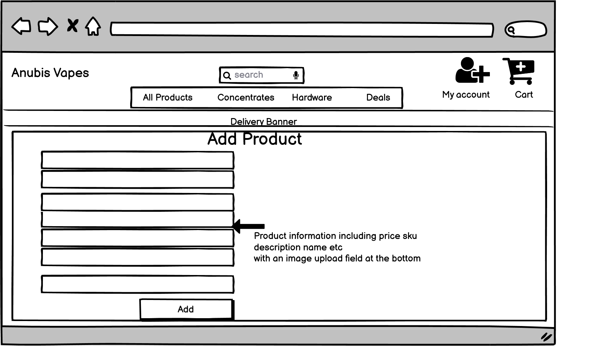
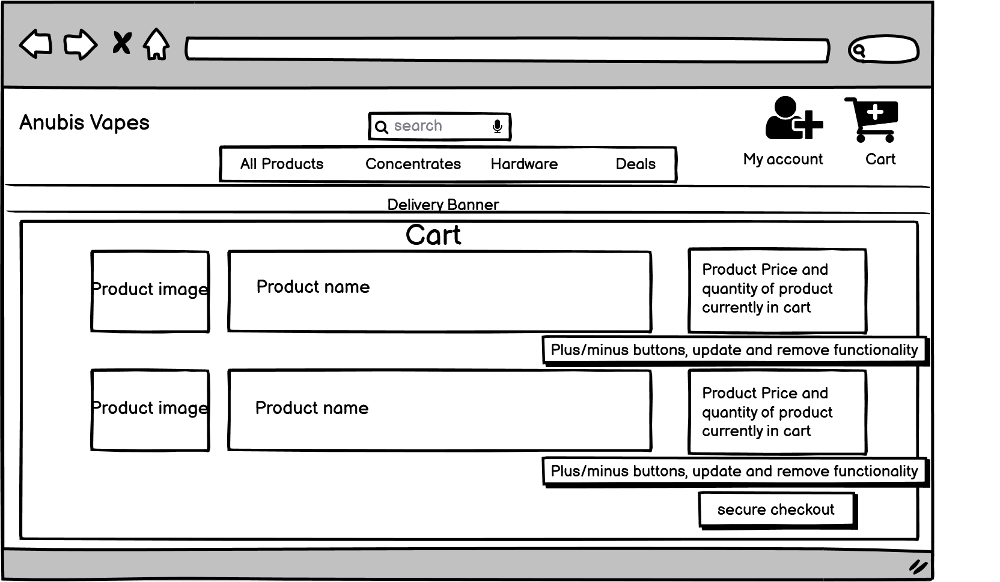
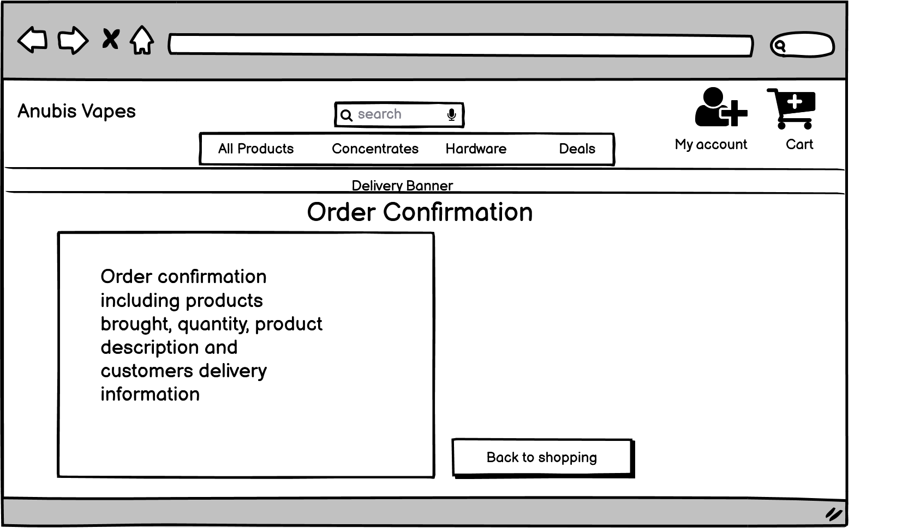
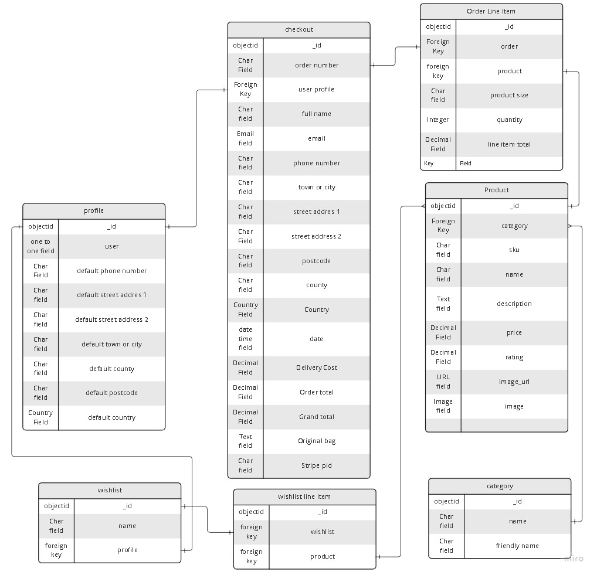

# Introduction

Welcome to the online e-commerce store Anubis Vapes! This is an online store using the Django framework alongside a postgresql database. In this shop not only can the user select as many items to purchase and use the secure checkout to pay for their items. The user can also register an account with Anubis Vapes to be able to pick items and place them in their own wishlist which will save on their account, and also have the ability to pre-save their delivery information to make purchases even easier!

Live site can be viewed here: https://anubis-vapes.herokuapp.com/

# Contents

* [**User Experience UX**](<#user-experience-ux>)
    * [**Purpose**](#purpose)
    * [**User Stories**](#user-stories)
    * [**Wireframes**](#wireframes)
    * [**Web Design**](#web-design)
    * [**Data-Schema**](#data-schema)
    * [**Accessibility**](#accessibility)
* [**Website Walkthrough**](#website-walkthrough)
* [**Methods For Creating The Site**](#methods-for-creating-the-site)
* [**Testing**](#testing)
    * [**Development Testing**](#development-testing)
    * [**Deployment Testing**](#deployment-testing)
    * [**Code Validation**](#code-validation)
* [**Bugs**](#bugs)
* [**Deployment**](#deployment)

# User Experience (UX) design

## Purpose
  [Go to the top](#contents)

The main purpose of this app is an e-commerce store, but also a site that allows users to shop for vape items to stop them smoking. I used to smoke 50g tobacco a week and since vaping my health has improved drastically, so to provide a completely accessible site, that delivers some great products that everyone can see and use is very important to me. 

The target audience is people that already vape, or people that want to stop smoking themselves, but also people who suffer medical conditions who may need to stop smoking. These can be people from all ages.

This is also a vape shop that has been designed with security in mind. From the secure checkout, and to pages that have restricted access for the users to keep their information safe, such as the wishlist and user profile (including delivery information)

## User Stories
  [Go to the top](#contents)

## WireFrames
  [Go to the top](#contents)

## Web Design
  [Go to the top](#contents)

This application has been designed with the following main principles:
- Simple and easy to navigate
- Completely responsive across all devices
- A very accessible site for everyone to use and read
- To demonstrate great vape products for everyone
- To be secure

The design of this website has been very simple. The main cause of this has been the deadline to which i have been working to being incredibly tight, so what i focused on was the site being fully functional, easy to read and to be as accessible as i could make it. In the future i will look to improve on the aesthetics of the site.

I have chosen to make the product cards quite large, this has been done to mainly have the users main focus be on the products themselves, and for the vape juice, to really drive home to the user the flavours of which they are looking at. If  had more funds i would like to have had designed a vape bottle to use in its place, however i do feel having a representation of the flavours does provide the user with a more apitising view of what flavours are on offer.

With accessibility in mind and having the ability for this site to be read by screen readers as much as possible, this is the reason for the text of the website being black and quite basic.

## Data-Schema
  [Go to the top](#contents)

