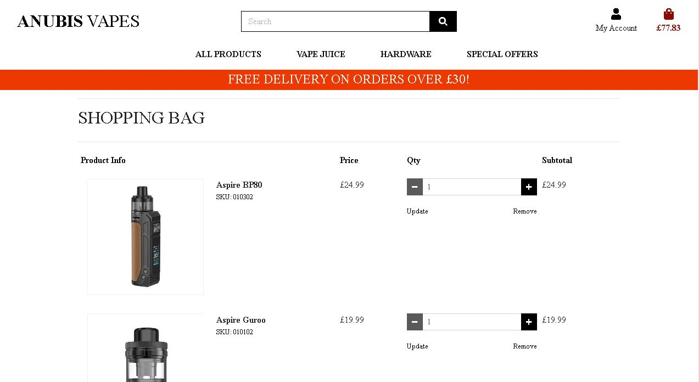

# Introduction

Welcome to the online e-commerce store Anubis Vapes! This is an online store using the Django framework alongside a postgresql database. In this shop not only can the user select as many items to purchase and use the secure checkout to pay for their items. The user can also register an account with Anubis Vapes to be able to pick items and place them in their own wishlist which will save on their account, and also have the ability to pre-save their delivery information to make purchases even easier!

Live site can be viewed here: https://anubis-vapes.herokuapp.com/

# Contents

* [**User Experience UX**](<#user-experience-ux>)
    * [**Purpose**](#purpose)
    * [**User Stories**](#user-stories)
    * [**Wireframes**](#wireframes)
    * [**Web Design**](#web-design)
    * [**Data-Schema**](#data-schema)
    * [**Accessibility**](#accessibility)
* [**Website Walkthrough**](#website-walkthrough)
* [**Methods For Creating The Site**](#methods-for-creating-the-site)
* [**Testing**](#testing)
    * [**Development Testing**](#development-testing)
    * [**Deployment Testing**](#deployment-testing)
    * [**Code Validation**](#code-validation)
* [**Bugs**](#bugs)
* [**Deployment**](#deployment)
* [**Credits**](#credits)

# User Experience (UX) design

## Purpose
  [Go to the top](#contents)

The main purpose of this app is an e-commerce store, but also a site that allows users to shop for vape items to stop them smoking. I used to smoke 50g tobacco a week and since vaping my health has improved drastically, so to provide a completely accessible site, that delivers some great products that everyone can see and use is very important to me. 

The target audience is people that already vape, or people that want to stop smoking themselves, but also people who suffer medical conditions who may need to stop smoking. These can be people from all ages.

This is also a vape shop that has been designed with security in mind. From the secure checkout, and to pages that have restricted access for the users to keep their information safe, such as the wishlist and user profile (including delivery information)

## User Stories
  [Go to the top](#contents)

### User Stories For A Shopper and Anonymous Users

Number | User Stories                               
-------| ----------------------------------------------
1a | View a list of products to select which ones to buy |
2a | View a specific category to find what a user wants easily |
3a | View specifc product details, eg. price, description |
4a | Sort a list of items. By price, alphabetically, rating, and category |
5a | To be able to search for an item |
6a | Select a quantity of an item to buy |
7a | To view items in my bag including the total of products and price |
8a | To be able to enter payment details to purchase items |
9a | To see my order confirmation including what the user has bought |

### User Stories For Registered Users

Number | User Stories                               
-------| ----------------------------------------------
1b | Be able to register the users account |
2b | To be able to log in/out of the users account |
3b | To recover a lost Password |
4b | Get a confirmation email to aid in registering the users account |
5b | Have a personal user profile |
6b | To save delivery information to profile to speed up the checkout process |
7b | To be able to place items in their designated wishlist |
8b | To be able to view their wishlist |

### User Stories For Site Administration

Number | User Stories                               
-------| ----------------------------------------------
1c | To be able to add a product with its information to the website |
2c | To be able to edit a product and its information |
3c | To delete a product and its information |

## WireFrames
  [Go to the top](#contents)

## Web Design
  [Go to the top](#contents)

This application has been designed with the following main principles:
- Simple and easy to navigate
- Completely responsive across all devices
- A very accessible site for everyone to use and read
- To demonstrate great vape products for everyone
- To be secure

The design of this website has been very simple. The main cause of this has been the deadline to which i have been working to being incredibly tight, so what i focused on was the site being fully functional, easy to read and to be as accessible as i could make it. In the future i will look to improve on the aesthetics of the site.

I have chosen to make the product cards quite large, this has been done to mainly have the users main focus be on the products themselves, and for the vape juice, to really drive home to the user the flavours of which they are looking at. If  had more funds i would like to have had designed a vape bottle to use in its place, however i do feel having a representation of the flavours does provide the user with a more apitising view of what flavours are on offer.

With accessibility in mind and having the ability for this site to be read by screen readers as much as possible, this is the reason for the text of the website being black and quite basic.

## Data-Schema
  [Go to the top](#contents)

Above is the data schema for the relational database in the Anubis Vapes application.

I have not added a key to this Entity Relationship Diagram as i have labelled each variable next to the name as to what each individual variable is.

What this diagram describes is that the relationship between the profile and wishlist is a 1 to 1 relationship meaning for each profile you can create 1 wishlist. This is also the case for the relationship between the profile and user model.

For the the relationship between the products and the wishlist, this is a one to many relationship meaning many products can go into 1 wishlist. This is also the same between the products and categories, as many products can go into one category.

This diagram also shows that per order only 1 order number is assigned showing a 1 to 1 relationship.

Also this shows that the checkout is updated by using the orderLineitem model as a 1 to 1 relationship. 

## Accessibility
  [Go to the top](#contents)

Above you can see that across the site i was successful in making this site accessible in the development stage which has carried over into the deployed stage.

However below are the only 2 pages in the site that isnt a 100% accessible. In the products page, i was unable to give the link a decernable name without causing errors in the HTML validation, even after extensive research and many attempts, however this page still reads at 97%. In the checkout page the only issue i was not able to fix was the picture of the product in the checkout. Again after many attempts and much research i was unable to find this solution, this page however still reads at 98%.

# Website Walkthrough
  [Go to the top](#contents)

This is the products page (while logged in as admin) this satisfies user stories 1a (for this user story obviously without the user logged in they would not see the edit/delete bvuttons),3c,2c, 5a and 7b, and also 2a by using the dropdown box or the nav bar to select a category, and 4a by using the dropdown box to sort the products by price, alphabetically,category, and rating

This is the products detail page (while logged in as admin) this satisfies user stories 3a,6a(for this user story obviously without the user logged in they would not see the edit/delete bvuttons) , 2c and 3c

This is the sign in page for the website and this satisfies user stories 2b, with access to 3b

This is the registration page and this satisfies user stories 1b, which upon completion would recieve a confirmation which satisfies user story 4b

This is the password reset page and this satisfies user story 3b

This is the users profile page where they save delivery information, this satisfies user stories 5b, and 6b

This is the wishlist page and this satisfies user stories 7b and 8b

This is the add product page for admin users and this satisfies user story 1c

This is the cart page and this satisfies user stories 7a

This is the checkout page and satisfies user story 8a 

This is the checkout success page and this satisfies user story 9a

# Methods For Creating The Site
  [Go to the top](#contents)

* [HTML5](https://en.wikipedia.org/wiki/HTML) (was used for structuring and presenting content of the website)
* [CSS](https://en.wikipedia.org/wiki/CSS) (used for the styling of the content)
* [Javascript](https://en.wikipedia.org/wiki/JavaScript) (used for the initialisation of features such as quantity buttons)
* [Python](https://en.wikipedia.org/wiki/Python_(programming_language)) (used for programming the application through Django)
* [Django](https://en.wikipedia.org/wiki/Django_(web_framework)) (used as the framework for this project)
* [Google Fonts](https://fonts.google.com/) (used for all the font styling within the project)
* [Chrome](https://www.google.com/intl/en_uk/chrome/) (used to debug and test the source code and to test site responsiveness)
* [GitHub](https://github.com/) (used to create the repository and store the projects code after pushed from Git)
* [Heroku](https://id.heroku.com/login) (Used for deployment of the application alongisde Github)
* [Gitpod](https://www.gitpod.io/) (used for the editing of code within the project for the site)
* [W3C Markup](https://validator.w3.org/) (used for validating the html5 code)
* [CSS Validator](https://www.cssportal.com/css-validator/) (used for validating the CSS code)
* [JSHint](https://jshint.com/) (this was also used for validating javascript code and double checking results from JSLint)
* [Am I Responsive](http://ami.responsivedesign.is/#) (used to generate the live site images, and also used to test responsiveness)
* [Balsamiq](https://balsamiq.com/) (This was used to generate the wireframes)
* [Dropbox](https://www.dropbox.com) (This was used to host the product images before being pushed to Amazon Web Services)
* [PeP8 online](http://pep8online.com/) (Used to check and prove pep8 compliance for models,routes.py files)
* [Miro](https://miro.com) (This was used to create the entity relationship diagram)
* [Amazon Web Services](https://aws.amazon.com/?nc2=h_lg) (This was used, specifically the S3 bucket to host all images on the site and all static files such as js and css files)
* [stripe](https://stripe.com) (This was used for payments on the site)

# Testing
  [Go to the top](#contents)

 Please refer to [**Testing **](testing.md) for information on testing.

 
# Bugs
  [Go to the top](#contents)

- Image quality
The first bug that ive found on my site which i was not able to remedy was the quality of the home image on the home page. I did ensure that this image was sized well, with a good ratio, and this was fine in the development of this site. However when i deployed to heroku and used amazon web services to host the images, the picture is now lower quality and i have tried to fix this, by changing settings in my bucket and even re uploading the image, however since i know the size isnt an issue i can only determine that something in the deployment has affected this, and i have not found a fix for this as of yet.

- Checkout Views
In the pep8 validation process, it identified an error on the checkout views validation on line 75, saying a line was too long. As stated in the code validation section on the testing.md file I have attempted many times to remedy this issue, and even after extensive research i was unable to find a fix that wouldnt break the checkout app. All previous attempts to fix this resulted in the checkout app not working properly and was unable to process any payments, so ive had to leave it in and document the error.

- Javascript
Another bug i found while developing this site was the use of javascript in html pages and validating that javascript itself. Where i have been able to, i have moved as much javascript out of my html pages as possible using a update_and_remove file. However in every page of the site i have had to leave some of the javascript where it is. In attempting to remove this javascript and separating it, it broke the toasts function that gives messages to the users on their actions, and other functions as well. After extensive research and attempts i was unable to fix this issue. This also causes the javascript not to pass through jslint without errors. So i have made the decision to leave this, as the site functions in its current state and again i havent found a way to fix this issue.

- HTML Validation
Another bug i found was that due to the issue above (javascript) every page does throw up a warning when running through the html validator used (see methods section) about the use of the type attribute for JavaScript resources. Again in trying to remedy this issue i found that my site was throwing up errors in the development stages so i have left them in the html as stated above to ensure the site functions correctly.

Another issue with the HTML validation was in the checkout page validation. This 

# Deployment
  [Go to the top](#contents)

The app was deployed on Heroku and used Amazon Web Services to store static and media files.

## Creating The Heroku App

- Registier/login on Heroku.
- Click 'New' > 'Create new app'.
- Give the app a name.
- Select the region closest to you.

## Setting up Postgres Database

- On your Heroku app:

- Select 'Resources' tab.

- Search and select 'Heroku Postgres' add-on.

- In your work enviroment:

- install dj_database_url and psycopg2-binary and update requirements.txt file

- In settings.py:

- import dj_database_url

- Temporarily change your default DATABASES config to: 'default': dj_database_url.parse( YOUR_DATABASE_URL ) using the database url from your heroku app config vars. After you apply the migrations, change DATABASES config back, so your database doesnt end up in version control

- Apply migrations to new database useing migrate command in the terminal.

- Create a superuser using createsuperuser command in the terminal.

- In settings.py:

- Connect your project to the postgres database for the live site, and your default database for version control, using the config variable from Heroku by adding if 'DATABASE_URL' in os.environ: DATABASES = {'default': dj_database_url.parse(os.environ.get('DATABASE_URL'))} else: before your default database settings

- Install gunicorn and update requirements.txt file.

- Create Procfile and add web: gunicorn <YOUR_APP_NAME>.wsgi:application

- Temporarily add DISABLE_COLLECTSTATIC to heroku config vars with value of 1 so heroku doesnt try to collect static files when you deploy

- in serrings.py:

- add hostname of your heroku app to ALLOWED_HOSTS

- Add and commit your changes, then push to heroku (I used gitpod so the command was git push heroku main)

## Setting Up Automatic Deployment From Gitpod

- in heroku app:

- Select the 'Deploy' tab:

- Choose your deployment method i.e gitpod

- Search for your repository

- Click connect

- Enable automatic deploy

## Creating An Account With Amazon Web Services

- Go to AWS website and click 'Create an account'

- Fill in the details and click 'Continue'

- Select 'Personal' account type and fill out details then click 'Create Account and Continue'

- Fill out the creditcard details, which will be charged if you go over the free useage limit

- Sign into your new account

## Creating an S3 Bucket 

- Buckets are used to store files for your live site.

- On dashboard, search and open S3

- In Amazon s3:

- Create a new bucket
- Fill in details
- Uncheck 'block all public access'
- Check 'Acknowledge bucket will be public'
- Click 'Create bucket'
- In your new bucket:
- On 'Properties' tab:
- Select 'Static website hosting'
- Check 'Use this bucket to host a website' and fill in default values then click 'Save'
- On 'Permissions' tab:
- Go to 'CORS configuration' section and paste: [{ "AllowedHeaders": ["Authorization"],"AllowedMethods": ["GET"],"AllowedOrigins": ["*"],"ExposeHeaders": []}]
- Go to 'Bucket Policy' section
- Click 'Policy generator' to create a security policy for the bucket
- Select 'S3 Bucket Policy' for Type of Policy
- Enter * in the 'Principal' sections to allow all principals
- Select GetObject in 'Actions' section
- Copy ARN (amazon resource name) from 'Bucket Policy' tab and past into ARN box on Policy   Generator tab
- Click 'Add Statement' > 'Generate Policy'
- Copy and paste th policy into the 'bucket policy editor'
- On the end of 'Resource key' section of the policy add /* to allow access to all resources in the bucket
- Click 'Save'

## Creating An IAM User

- This is used to access your bucket, you will create a group for the user, create an access policy so the group can access you bucket, then assign the user to the group so it can use the policy to access all your files

- On AWS dashboard search and open IAM

- On IAM dashboard:

- On 'Groups' tab:
- Click 'Create New Group', give it a name, then click next till you come to 'Create Group'
- On 'Policies' tab:
- Click 'Create Policy'
- Go to 'JSON' tab
- Click 'import managed policy'
- Search for S3, and import the pre-built 's3 full access' policy
- Get your bucket ARN and paste it twice; once as it is, and once with /* at the end, after "Resource": and in square brackets: [ "<YOUR_BUCKET_ARN>", "<YOUR_BUCKET_ARN>/*" ]
- Click 'Review policy'
- Give it a name and description
- Click 'Create Policy'
- On 'Groups' tab:
- Select your bucket
- Click 'Attach Policy'
- Search, select and attach your newly created policy
- On 'Users' tab:
- Click 'Add User'
- Create a user for your static files
- Check 'Programatic access' box
- Click 'Next' to go to permissions page
- Check the box to select the group you just made
- Click next untill you reach 'Create User'
- Download and save the CSV file by clicking 'Download CSV'. This will contain the users access key and secret access key Once you leave the page you will not be able to return and download the file again

## Connect Django to S3

- In you workspace terminal, install boto3 and django-storages then add to requirements.txt file

- In settings.py:

- Add storages to installed apps
- Add if 'USE_AWS' in os.environ: AWS_STORAGE_BUCKET_NAME = '<YOUR_BUCKET_NAME>' - AWS_S3_REGION_NAME = ''<YOUR_BUCKET_REGION>' AWS_ACCESS_KEY_ID = os.environ.get('AWS_ACCESS_KEY_ID')AWS_SECRET_ACCESS_KEY = os.environ.get('AWS_SECRET_ACCESS_KEY') AWS_S3_CUSTOM_DOMAIN = f'{AWS_STORAGE_BUCKET_NAME}.s3.amazonaws.com'

- In Heroku config vars:

- Add 'USE_AWS' = True, 'AWS_ACCESS_KEY_ID' and 'AWS_SECRET_ACCESS_KEY' variables from the CSV file you downloaded
- Remove 'Disable_COLLECTSTATIC' variable

- Create 'custom_storages.py' file

- Add from django.conf import settings and from storages.backends.23boto3 import s3Boto3Storage
- Add a new class for Static files and one for Media files:
- class StaticStorage(S3Boto3Storage): location = settings.STATICFILES_LOCATION
- class MediaStorage(S3Boto3Storage): location = settings.MEDIAFILES_LOCATION

- Commit your changes and push them to heroku

- Your S3 bucket should now have a 'static' folder in it with all your static files

- In your bucket:

- Add folder called 'media'
- Add all your media files
- in 'Manage Public Permission' section, select 'grant public read access to these objects'
- Upload

## Credits
  [Go to the top](#contents)

- Code:
  - The main structure of the site came from the Code Institute 'Boutique Ado' project
  - General help from:
    - Code Institutes Student Support
    - Various sources from Stack Overflow for the wishlist app
    - Django documentation
    - Bootstrap 4 documentation
    - W3Schools
    - And help from my fellow cohort member Jon Cohen for continued help and support throughout the development of this project!

- Images:
  - Home page image was from shutterstock
  - Product images were of generic images off of google images
  - Hardware images were off of www.vapestore.co.uk