# Contents

* [**Testing**](#testing)
    * [**Manual Testing**](#manual-testing)
    * [**Development Testing**](#development-testing)
    * [**Deployment Testing**](#deployment-testing)
    * [**Automated Testing**](#automated-testing)
    * [**Code Validation**](#code-validation)

# Testing
  [Go to the top](#contents)

## Manual Testing
  [Go to the top](#contents)

In the development AND deployed versions of this site, one way of manual testing i carried out is to physically perform the tasks that were required of the site and show that they were successful,  and the proof of this is below:

This first image shows a successful login and that it has been tested

This image shows a successful sign out of an account and that the site notifies the user

This image shows a product successfully being added to the users wishlist

This image shows a product successfully being removed from the wishlist

This image shows a product successfully being added to the cart 

This shows the cart successfully updating the quantity of products 

This image shows a product successfully being removed from the cart

This image shows a product has successfully been added to the site

This image shows a product has successfully been edited on the site

This image shows a product successfully being deleted from the site

This image shows that when adding a product the admin user must enter the correct amount of numbers

This image shows a successfull payment being made to the site and that the user is given a confirmation of their order and a order number.

## Development Testing
  [Go to the top](#contents)

Test            | Outcome                          | Result
--------------- | -------------------------------- | ------------
Navigation Bar  | Does the nav bar navigate to each page?| Pass 
Buttons | Does all buttons function as intended consistantly?| Pass
User Story 1a | View a list of products to select which ones to buy | Pass
User story 2a | View a specific category to find what a user wants easily | Pass
User Story 3a | View specifc product details, eg. price, description | Pass
User story 4a | Sort a list of items. By price, alphabetically, rating, and category | Pass
User story 5a | To be able to search for an item | Pass
User story 6a | Select a quantity of an item to buy | Pass
User story 7a | To view items in my bag including the total of products and price | Pass
User story 8a | To be able to enter payment details to purchase items | Pass
User story 9a | To see my order confirmation including what the user has bought | Pass
User story 1b | Be able to register the users account | Pass
User story 2b | To be able to log in/out of the users account | Pass
User story 3b | To recover a lost Password | Pass
User story 4b | Get a confirmation email to aid in registering the users account | Pass
User story 5b | Have a personal user profile | Pass
User story 6b | To save delivery information to profile to speed up the checkout process | Pass
User story 7b | To be able to place items in their designated wishlist | Pass
User story 8b | To be able to view their wishlist | Pass
User story 1c | To be able to add a product with its information to the website | Pass
User story 2b | To be able to edit a product and its information | Pass
User story 3c | To delete a product and its information | Pass
Responsiveness | Is the application responsive across all devices? | Pass
Accessibility | Is the application accessible to all users? | Pass (see accessibility section)
Error Handling | In the applications development is the error handlers to handle internal server errors and 404 errors? | Pass (404.html, 500.html)

## Deployment Testing
  [Go to the top](#contents)

Test            | Outcome                          | Result
--------------- | -------------------------------- | ------------
Checked against development version | Has the development testing criteria been applied to the deployed version? Any issues? | Pass, No issues
Visual Checks | Has visual checks been carried out in full on deployment version? | Yes, Pass
Code checked | Has the code been checked for errors? | Yes, Pass (errors have been noted that i have been unable to change, see code validation section)
Console errors | Is there any errors in the console? | No, Pass
Stability | Does using the forward and backward keys break the site? | No, Pass
Stability | Does the site work as intended? | Yes, Pass
Security | Can only logged in users access the pages on the application (minus the registration page) such as wishlist app and profile pages | Yes, Pass
Error Handling | Does the application gracefully handle errors that the user may cause in the application and redirect the user back to the site without the use of the browsers navigation buttons? | Yes, Pass 
Error Handling | Can a user break the site using URL manipulation? | No, this will be handled by 404 and internal server error handlers, Pass
Links | are any of the links (on login page/register page/error page) broken and work as intended? | None broken, and work as intended, Pass

## Automated Testing
  [Go to the top](#contents)

In this project their are 3 instances of automated testing. I would like to note that if given more time i would have liked to have expanded on this, however the deadline was extremely tight.

The apps that i have tested are:
  - Home app
  - Bag app
  - Products app

What these tests tested:
  - That the app being tested renders the correct template

These tests are all in a separate file called test_views.py within the relevant app folders, and have been written using Python.

The evidence of the terminal results are below:

- This image shows the results of the home app being tested on the terminal in gitpod

- This image shows the results of the bag app being tested on the terminal in gitpod

- This image shows the results of the product app being tested on the terminal in gitpod

## Code Validation
  [Go to the top](#contents)

### CSS Validation

The following images shows the validations for the css:

- Project level CSS validation

- Profile level CSS validation

- Checkout level CSS validation

### HTML Validation

As stated in the bugs section in the html validation across the site, there is warnings for the javascript in the page. Where i have been able to, i have moved as much javascript out of my html pages as possible using a update_and_remove file. However in every page of the site i have had to leave some of the javascript where it is. In attempting to remove this javascript and separating it, it broke the toasts function that gives messages to the users on their actions, and other functions as well. After extensive research and attempts i was unable to fix this issue. This also causes the javascript not to pass through jslint without errors. So i have made the decision to leave this, as the site functions in its current state and again i havent found a way to fix this issue.

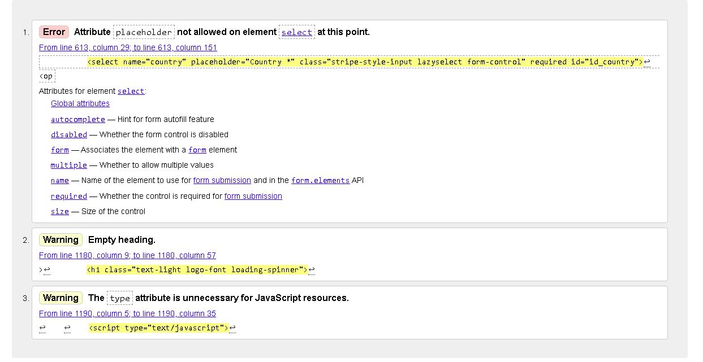

- This image is for the checkout page. As stated in the Bugs section. This page throws up an error involving placeholder content on select element at this time. I have left this in place mainly as this particular piece of code has come from the Django/bootstrap documentation and is also present in the boutique ado project. I have tried to remedy this issue but again due to a fix breaking the country select box i have left this as it is. I can only determine that this is a limitation of Django and bootstrap code as i am unable to fix this issue even with extensive research and many attempted fixes.

The checkout page also throws a warning for an empty heading however this is in place for the loading spinner that displays on screen when making a payment. I have tried to remedy this issue but again every fix i have attempted has broken this function.

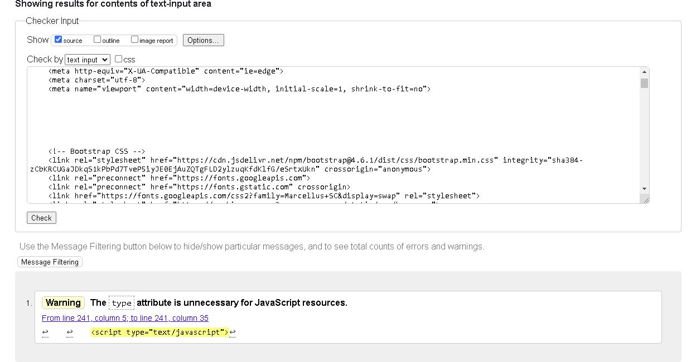

- This image is for the home page html validation

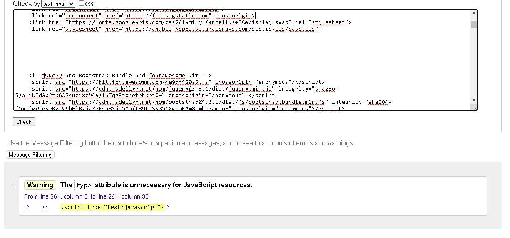

- This image is for the login page html validation

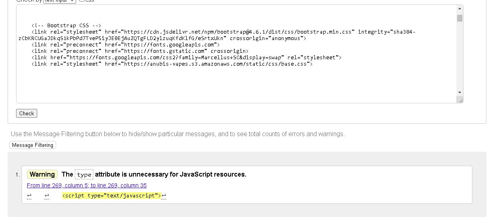

- This image is for the logout page html validation

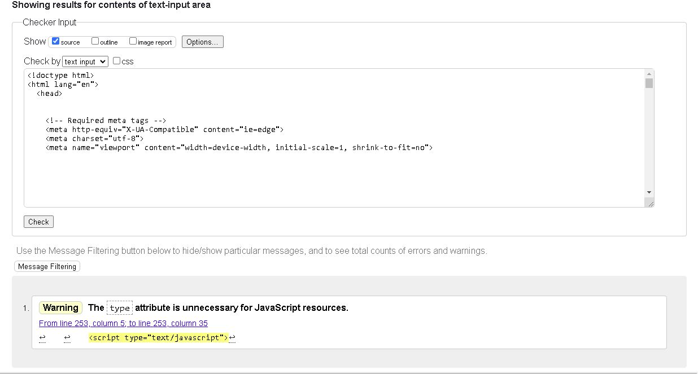

- This image is for the registration page html validation

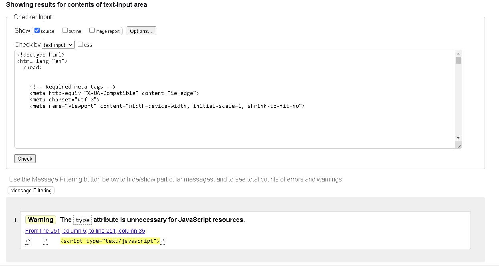

- This image is for the password reset page html validation

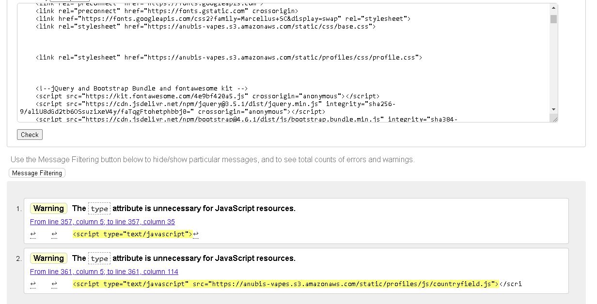

- This image is for the account profile page html validation

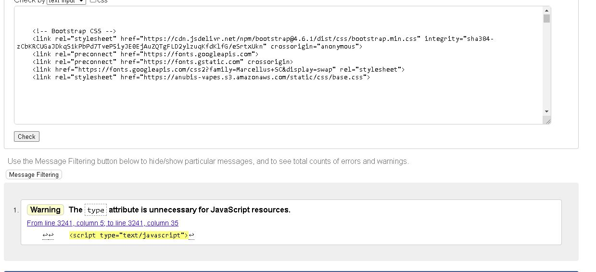

- This image is for the all products page html validation

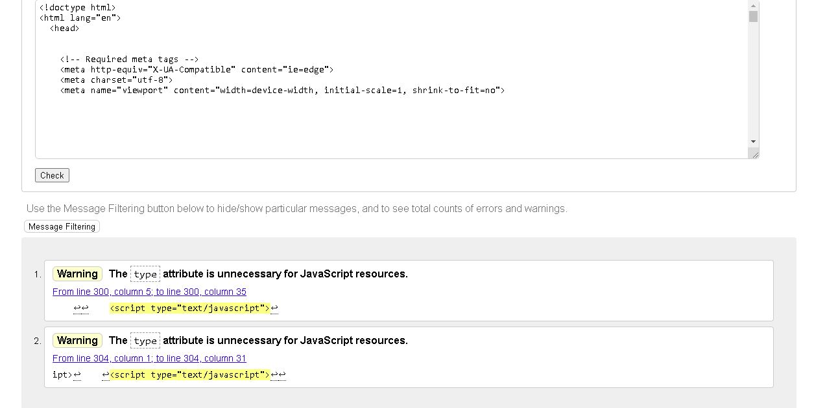

- This image is for the products detail page html validation

- This image is for the add products page html validation

- This image is for the edit product page html validation

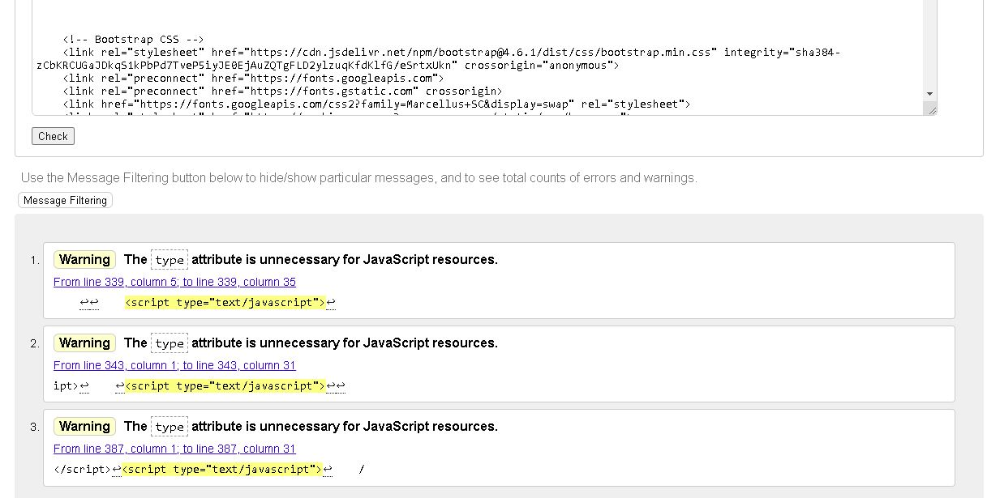

- This image is for the cart page html validation

- This image is for the checkout success page html validation

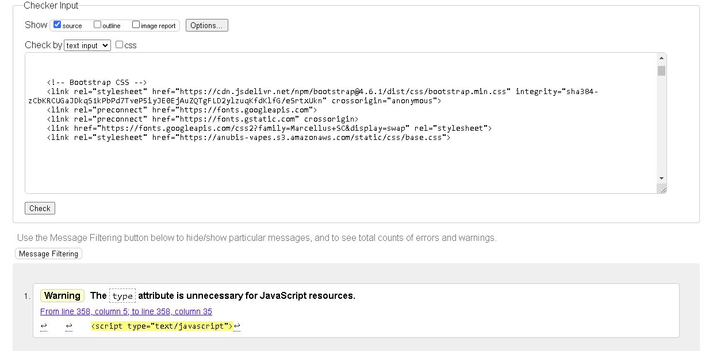

- This image is for the wishlist page html validation

### Pep8 Validation

Th efollowing images show the evidence for the pep8 validation across the site:

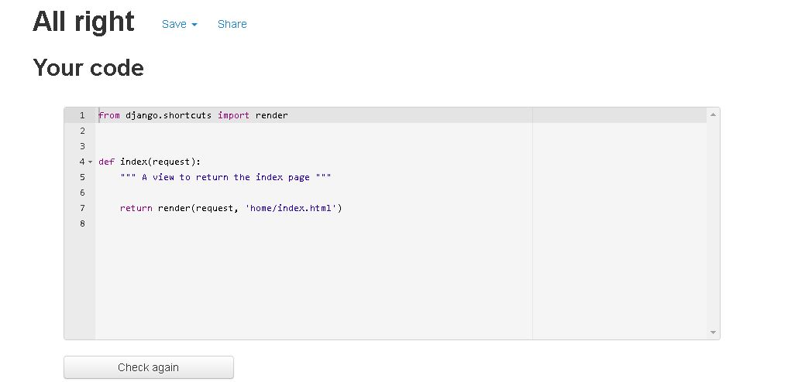

- This image is for the home app views

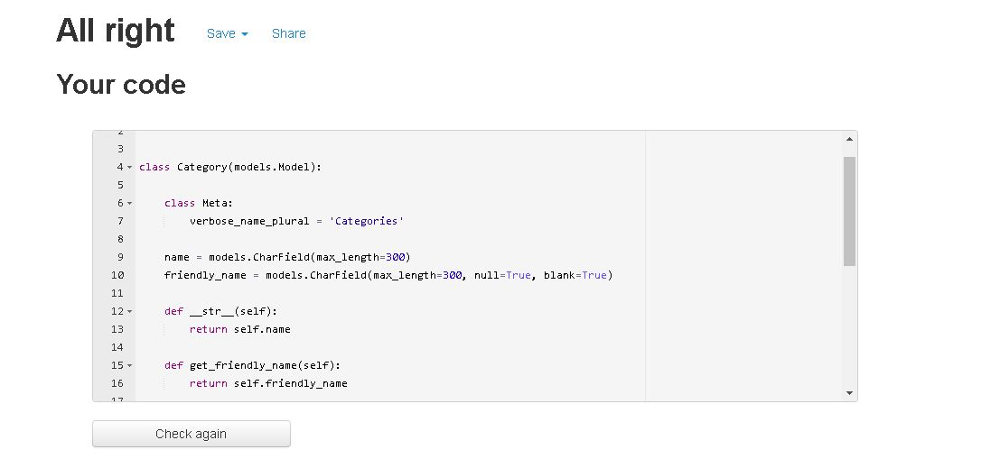

- This image is the for product app models

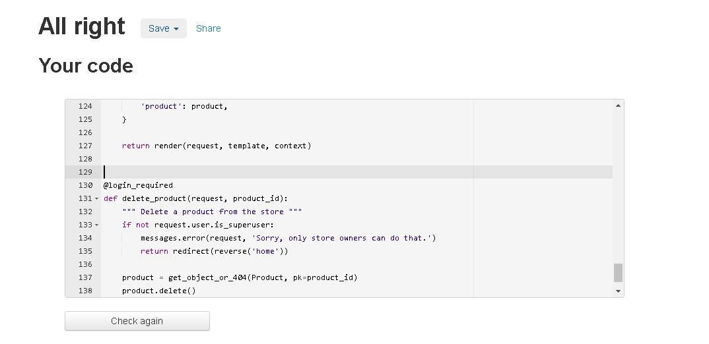

- This image is for the product app views

- This image is for the profile apps models

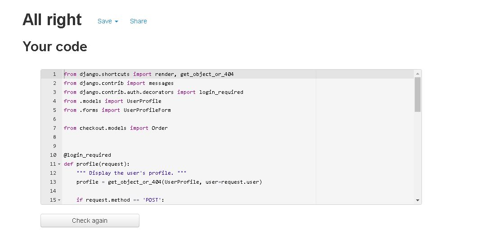

- This image is for the profile app views

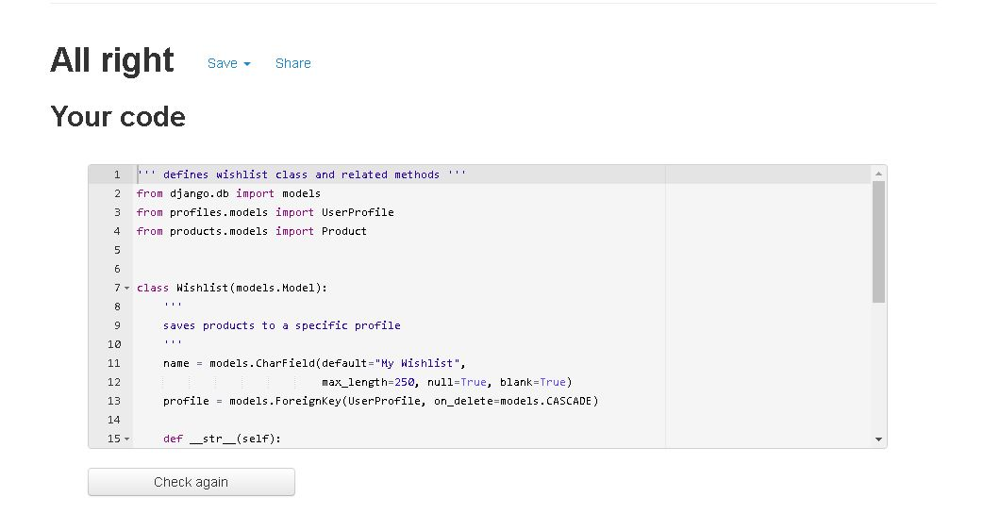

- This image is for the wishlist apps models

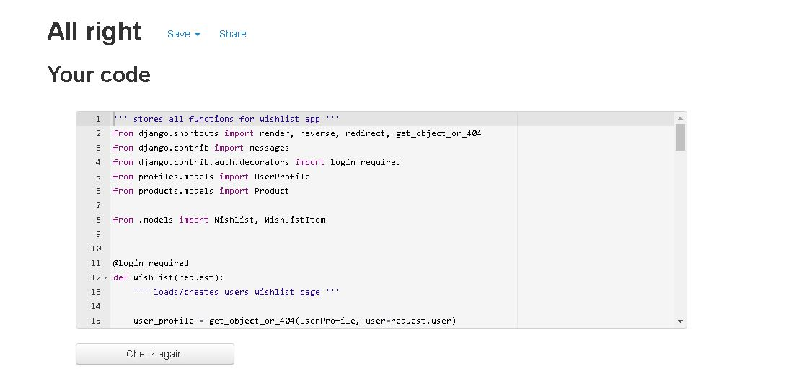

- This image is for the wishlist apps views

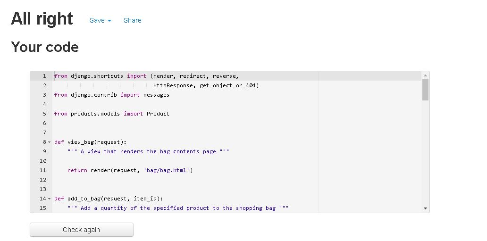

- This image is for the bag views

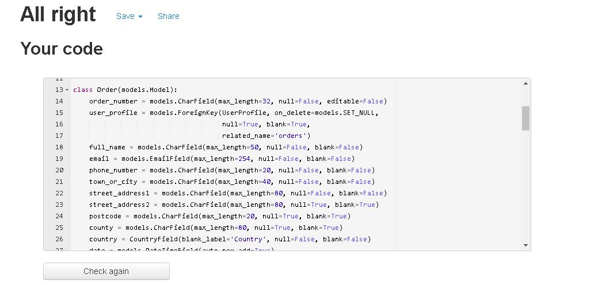

- This image is for the checkout apps models

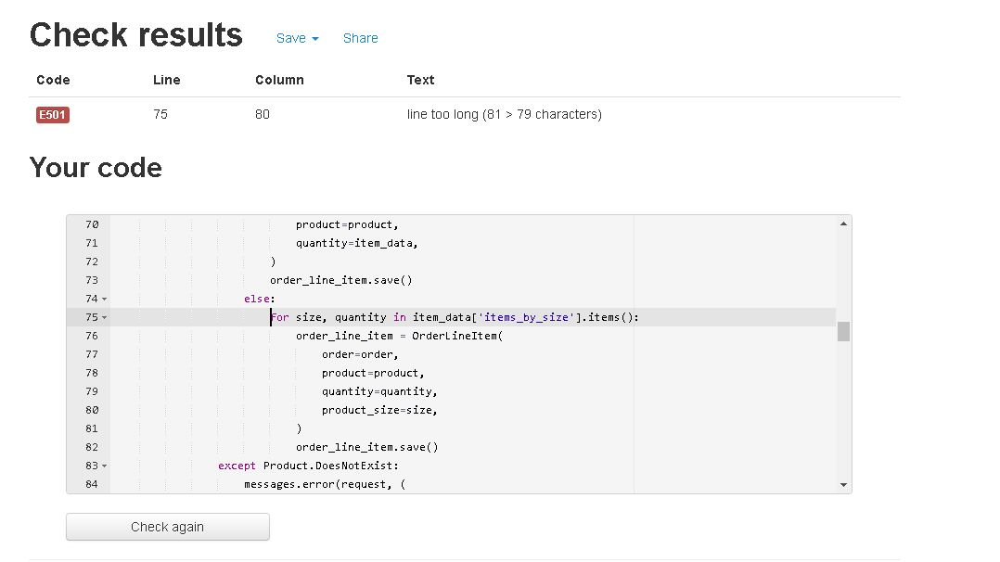

- This image is for the checkout apps views page. As you can see pep8 has identified a long line on line 75. I have attempted many times to remedy this issue, and even after extensive research i was unable to find a fix that wouldnt break the checkout app. All previous attempts to fix this resulted in the checkout app not working properly and was unable to process any payments, so ive had to leave it in and document the error.