# Contents

* [**Testing**](#testing)
    * [**Manual Testing**](#manual-testing)
    * [**Automated Testing**](#automated-testing)
    * [**Code Validation**](#code-validation)
    * [**Development Testing**](#development-testing)
    * [**Deployment Testing**](#deployment-testing)

# Testing
  [Go to the top](#contents)

## Manual Testing
  [Go to the top](#contents)

In the development and deployed versions of this site, one way of manual testing i carried out is to physically perform the tasks that were required of the site and show that they were successful,  and the proof of this is below:

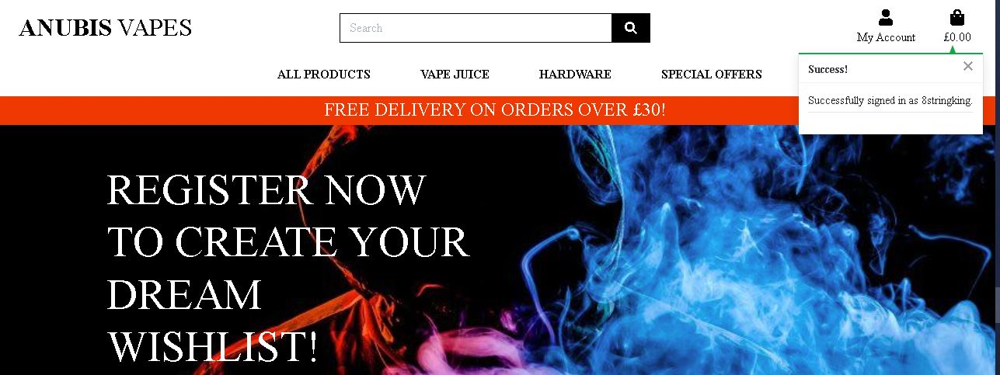

This first image shows a successful login and that it has been tested

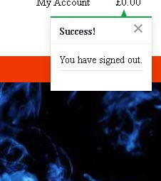

This image shows a successful sign out of an account and that the site notifies the user

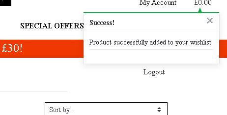

This image shows a product successfully being added to the users wishlist

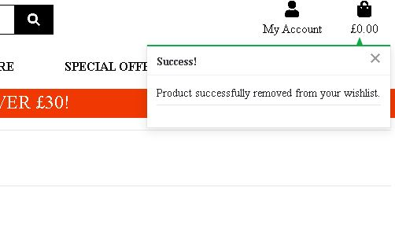

This image shows a product successfully being removed from the wishlist

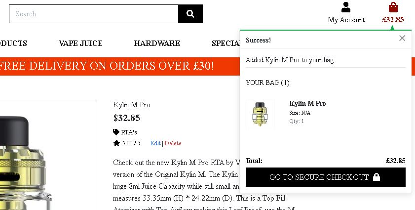

This image shows a product successfully being added to the cart 

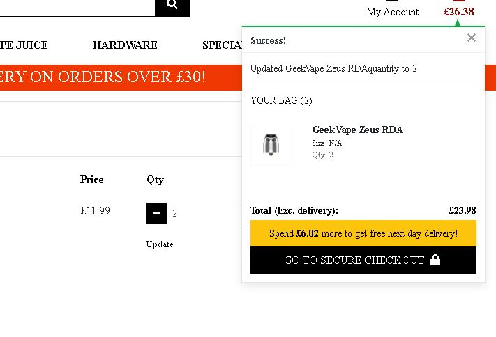

This shows the cart successfully updating the quantity of products 

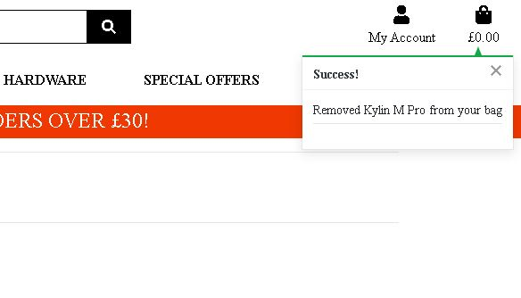

This image shows a product successfully being removed from the cart

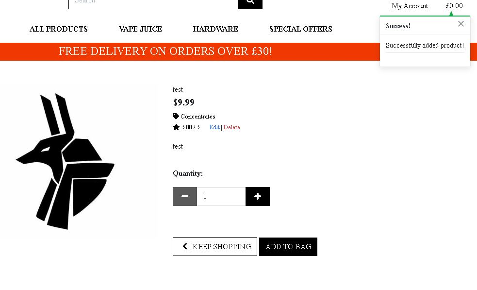

This image shows a product has successfully been added to the site

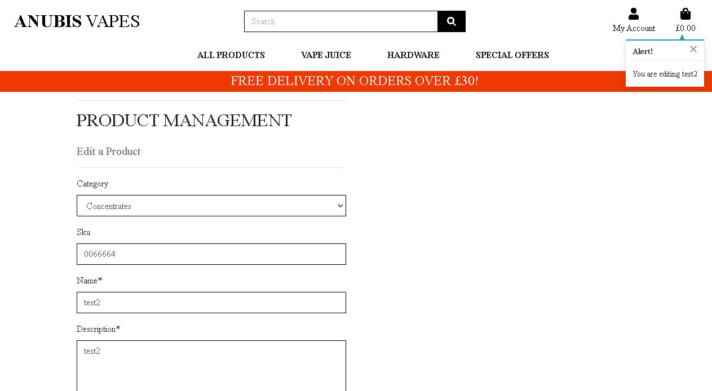

This image shows a product has successfully been edited on the site

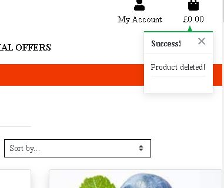

This image shows a product successfully being deleted from the site

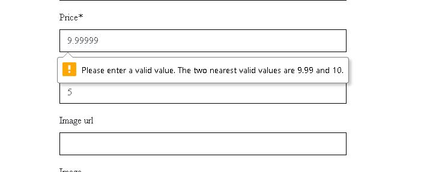

This image shows that when adding a product the admin user must enter the correct amount of numbers

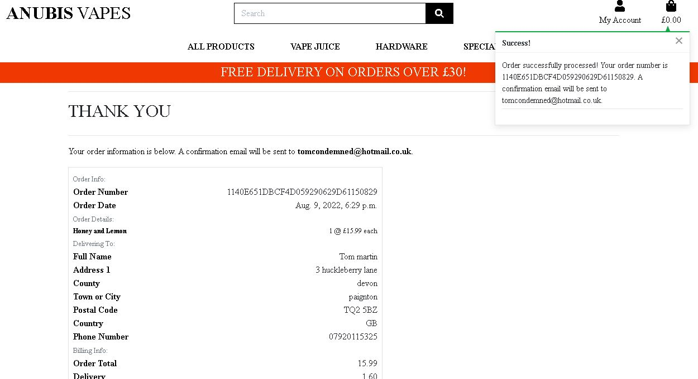

This image shows a successfull payment being made to the site and that the user is given a confirmation of their order and a order number.

## Automated Testing
  [Go to the top](#contents)

In this project their are 3 instances of automated testing. I would like to note that if given more time i would have liked to have expanded on this, however the deadline was extremely tight.

The apps that i have tested are:
  - Home app
  - Bag app
  - Products app

What these tests tested:
  - That the app being tested renders the correct template

These tests are all in a separate file called test_views.py within the relevant app folders, and have been written using Python.

The evidence of the terminal results are below:

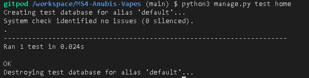

- This image shows the results of the home app being tested on the terminal in gitpod

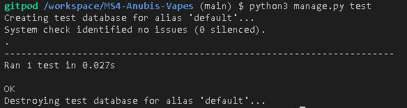

- This image shows the results of the bag app being tested on the terminal in gitpod

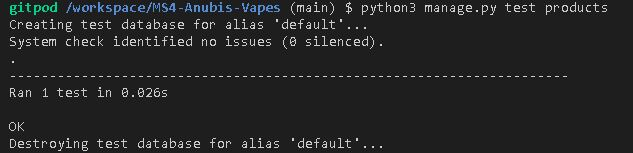

- This image shows the results of the product app being tested on the terminal in gitpod

## Code Validation
  [Go to the top](#contents)

This first image shows the validations for the css:

- Project level CSS validation

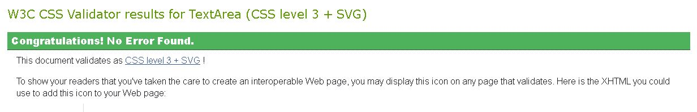

- Profile level CSS validation

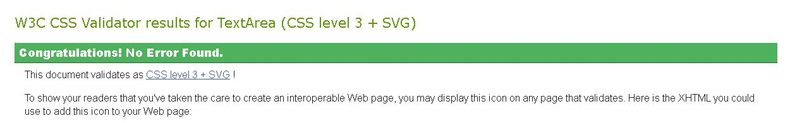

- Checkout level CSS validation

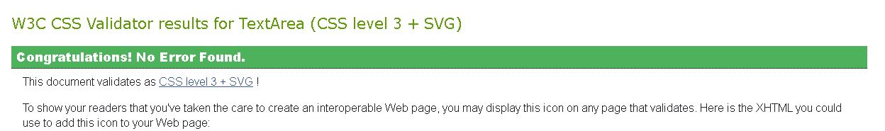

